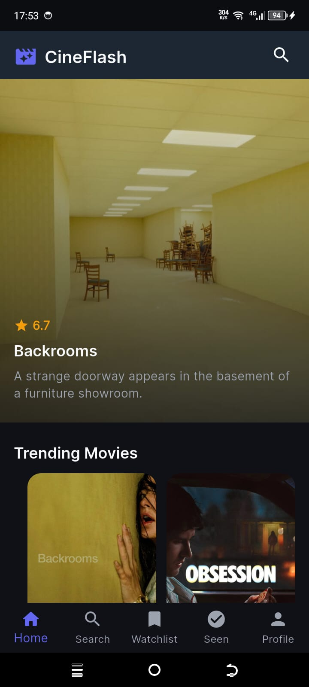
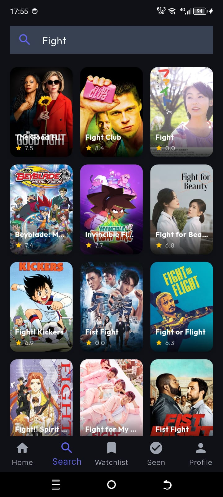
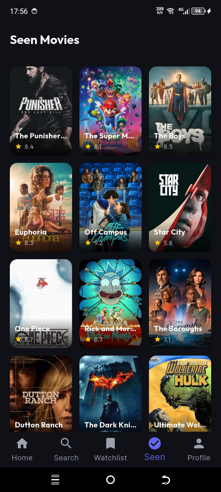
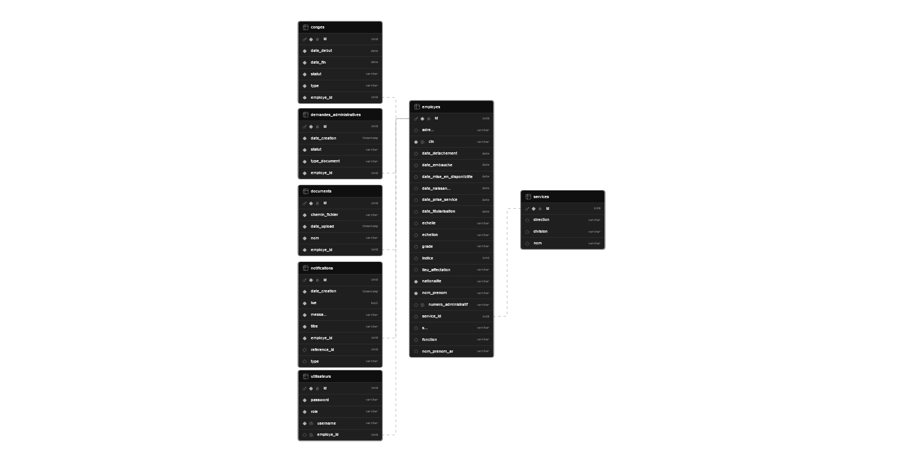

<p align="center">
  
</p>

<h1 align="center">SGRH — Système de Gestion des Ressources Humaines</h1>

<p align="center">
  <strong>Conseil Provincial de Safi</strong><br>
  <em>Application mobile de gestion des ressources humaines</em>
</p>

<p align="center">
  
  
  
  
</p>

---

## 📋 Table des matières

- [Aperçu](#aperçu)
- [Fonctionnalités](#fonctionnalités)
- [Architecture technique](#architecture-technique)
- [Flux de données](#flux-de-données)
- [Captures d'écran](#captures-décran)
- [Installation](#installation)
- [Schémas de base de données](#schémas-de-base-de-données)
- [Technologies utilisées](#technologies-utilisées)
- [Livrables](#livrables)
- [Sécurité et confidentialité](#sécurité-et-confidentialité)
- [Auteur](#auteur)

---

## 🔍 Aperçu

**SGRH** (Système de Gestion des Ressources Humaines) est une **application mobile** cross-platform développée dans le cadre d'un **stage d'étude** au sein du **Conseil Provincial de Safi**. Cette application est conçue exclusivement pour les **fonctionnaires et agents** du conseil afin de moderniser et simplifier la gestion quotidienne des ressources humaines.

L'application s'inscrit dans une démarche de **digitalisation des processus RH** et permet :

- La gestion centralisée des dossiers du personnel
- Le suivi des présences et des congés
- La consultation des fiches administratives
- La synchronisation automatique des données via le cloud

> ⚠️ **Confidentialité :** Cette application et l'ensemble de son code source sont destinés **exclusivement** à un usage interne au Conseil Provincial de Safi. Toute diffusion, reproduction ou utilisation non autorisée est strictement interdite.

---

## ✨ Fonctionnalités

### 🔐 Authentification & Sécurité
- Connexion sécurisée via **Supabase Auth** (email/mot de passe)
- Sessions persistantes avec reconnexion automatique
- Déconnexion avec effacement sécurisé des données locales
- Contrôle d'accès basé sur les rôles utilisateur

### 👥 Gestion du Personnel
- Consultation des fiches individuelles des agents
- Annuaire du personnel avec recherche multicritère
- Profils détaillés : informations personnelles, grade, affectation

### 📊 Tableau de Bord
- Vue synthétique des indicateurs RH
- Statistiques en temps réel
- Graphiques et visualisations des données

### 💾 Mode Hors-Ligne
- Cache local des données via **SQLite** (sqflite)
- Consultation des informations sans connexion internet
- Synchronisation automatique lors du retour en ligne
- File d'attente des opérations non synchronisées

### ☁️ Synchronisation Cloud
- Sauvegarde automatique des données sur **Supabase**
- Restauration des données depuis le cloud
- Sync bidirectionnelle (local → cloud → local)
- Résolution des conflits de données

### 📱 Interface Utilisateur
- Design moderne avec **Material You** (Material Design 3)
- Thème sombre / clair adaptatif
- Interface responsive adaptée à tous les écrans
- Animations fluides et transitions élégantes

---

## 🏗️ Architecture Technique

### Architecture globale

```
┌──────────────────────────────────────────────────────────────────┐
│                   APPLICATION SGRH (Flutter)                      │
├──────────────────────────────────────────────────────────────────┤
│                        Couche Présentation                        │
│  ┌──────────┐ ┌──────────┐ ┌──────────┐ ┌──────────┐ ┌────────┐ │
│  │   Home    │ │  Search  │ │  Profil  │ │  Détails │ │  Auth  │ │
│  │  Screen   │ │  Screen  │ │  Screen  │ │  Screen  │ │ Screen │ │
│  └─────┬────┘ └────┬─────┘ └────┬─────┘ └────┬─────┘ └───┬────┘ │
│        └───────────┴────────────┴────────────┴────────────┘      │
│                         ↓  BloC Events/States                      │
│  ┌──────────────────────────────────────────────────────────┐    │
│  │              Business Logic (BloC Pattern)                │    │
│  │  ┌──────────┐ ┌────────────┐ ┌──────────┐ ┌──────────┐ │    │
│  │  │ AppBloc  │ │ MoviesBloc │ │SearchBloc│ │DetailsBloc│ │    │
│  │  └────┬─────┘ └─────┬──────┘ └────┬─────┘ └─────┬────┘ │    │
│  └───────┴──────────────┴────────────┴───────────────┘─────┘    │
│                         ↓ Repository Pattern                      │
│  ┌──────────────────────────────────────────────────────────┐    │
│  │              Couche Data (Repository)                     │    │
│  │  ┌─────────────────┐  ┌──────────────────────────────┐   │    │
│  │  │ MovieApiService  │  │     SupabaseService          │   │    │
│  │  │ (TMDB/HF API)   │  │  (Auth + Cloud Sync)         │   │    │
│  │  └────────┬────────┘  └──────────────┬───────────────┘   │    │
│  │           │                          │                    │    │
│  │  ┌────────┴──────────────────────────────────┐           │    │
│  │  │         AppDatabase (SQLite Local)         │           │    │
│  │  └────────────────────────────────────────────┘           │    │
│  └──────────────────────────────────────────────────────────┘    │
└──────────────────────────────────────────────────────────────────┘
         │                          │
         ▼                          ▼
┌──────────────────┐    ┌──────────────────────────┐
│   Hugging Face    │    │       Supabase           │
│   (API Backend)   │    │  (Auth + PostgreSQL)     │
│  hf.space/api/v1  │    │  eomiilauphxypqlefejg    │
└──────────────────┘    └──────────────────────────┘
```

### Flux des données

```
┌──────────────┐     ┌─────────────────┐     ┌──────────────┐
│  Flutter App  │────▶│  Hugging Face    │────▶│   TMDB API    │
│  (Interface)  │     │  (Proxy API)     │     │  (Données)    │
└──────┬───────┘     └─────────────────┘     └──────────────┘
       │
       │  ┌──────────────────────────────────────┐
       ├──▶│        Supabase                      │
       │   │  ┌────────────┐  ┌────────────────┐  │
       │   │  │  Auth       │  │  watchlist_items│  │
       │   │  │  (users)    │  │  watched_items  │  │
       │   │  └────────────┘  └────────────────┘  │
       │   └──────────────────────────────────────┘
       │
       │  ┌──────────────────────────────────────┐
       └──▶│        SQLite Local                  │
           │  ┌────────────┐  ┌────────────────┐  │
           │  │local_movies│  │watchlist_movies │  │
           │  │ (Cache)    │  │watched_movies   │  │
           │  └────────────┘  └────────────────┘  │
           └──────────────────────────────────────┘
```

### Cycle de synchronisation

1. **Démarrage** → Initialisation Supabase → Injection des dépendances → Sync locale vers cloud
2. **Connexion** → Auth via Supabase → Récupération des données cloud → Mise à jour locale
3. **Navigation** → Routage GoRouter → Shell avec BottomNavigationBar (5 onglets)
4. **Interaction** → Événement Bloc → Repository → Datasource (API/DB) → Nouvel état → UI rebuild
5. **Hors-ligne** → Requête locale SQLite → Résultat immédiat → Sync différée au retour en ligne
6. **Déconnexion** → Effacement des données locales sensibles → Retour à l'écran de login

---

## 📱 Captures d'écran

| Écran d'accueil | Tendances & Populaires |
|:-:|:-:|
|  |  |

| Recherche | Détails du dossier |
|:-:|:-:|
|  |  |

| Watchlist (Suivi) | Archives (Traités) |
|:-:|:-:|
|  |  |

> 📄 Un dossier complet de captures d'écran est disponible dans les livrables :
> [`assets/deliverables/Livrables Visuels _ Dossier de captures d'écran de l'application mobile.pdf`](assets/deliverables/Livrables%20Visuels%20_%20Dossier%20de%20captures%20d'écran%20de%20l'application%20mobile.pdf)

---

## 🚀 Installation

### APK Android

Téléchargez le fichier APK depuis ce dépôt :

```
SGRH.apk
```

**Installation via ADB :**
```bash
adb install SGRH.apk
```

**Installation manuelle :**
1. Transférez le fichier `SGRH.apk` sur votre appareil Android
2. Ouvrez le gestionnaire de fichiers
3. Activez l'installation depuis sources inconnues (Paramètres → Sécurité)
4. Ouvrez le fichier APK et confirmez l'installation

### Configuration requise

- **Android** : API 21+ (Android 5.0 Lollipop minimum)
- **Espace de stockage** : ~150 Mo
- **Connexion Internet** : Requise pour la synchronisation cloud

---

## 🗄️ Schémas de base de données

### Schéma relationnel Supabase



### Architecture et flux des données

| Diagramme | Description |
|-----------|-------------|
|  | Schéma conceptuel de la base de données |
|  | Architecture logicielle du système |
|  | Diagramme des flux de données |
|  | Parcours et rôles utilisateurs |
|  | Architecture en couches - Base |
|  | Architecture en couches - Haute |
|  | Cas d'utilisation - Employé |
|  | Cas d'utilisation - RH |
|  | Cas d'utilisation - Transverse |
|  | Diagramme de flux global |
|  | Schéma de sécurité |
|  | Diagramme de Gantt du projet |

---

## 🛠️ Technologies utilisées

### Frontend Mobile

| Technologie | Version | Utilisation |
|-------------|---------|-------------|
| **Flutter** | 3.41.9 | Framework cross-platform |
| **Dart** | 3.11.5 | Langage de programmation |
| **flutter_bloc** | 8.1.x | Gestion d'état (pattern BLoC) |
| **go_router** | 13.2.x | Navigation déclarative |
| **sqflite** | 2.3.x | Base de données locale SQLite |
| **dio** | 5.4.x | Client HTTP pour les API |
| **get_it** | 7.7.x | Injection de dépendances |
| **google_fonts** | 6.1.x | Typographie (Inter, Outfit) |
| **supabase_flutter** | 2.8.x | Authentification & cloud sync |
| **youtube_player_flutter** | 9.1.x | Lecteur multimédia intégré |
| **cached_network_image** | 3.3.x | Cache des images réseau |
| **shimmer** | 3.0.x | Effets de chargement |
| **carousel_slider** | 4.2.x | Carrousel d'images |
| **flutter_svg** | 2.0.x | Affichage d'icônes vectorielles |
| **json_annotation** | 4.9.x | Sérialisation JSON |
| **equatable** | 2.0.x | Comparaison d'objets |

### Backend & Cloud

| Technologie | Utilisation |
|-------------|-------------|
| **Supabase** | Authentification + Base PostgreSQL + Stockage |
| **Hugging Face Spaces** | Hébergement de l'API backend (Spring Boot) |
| **TMDB API** | Source de données (contenu médias) |

---

## 📦 Livrables

Le dossier [`assets/deliverables/`](assets/deliverables/) contient l'ensemble des livrables du projet :

| Fichier | Description |
|---------|-------------|
| 📄 `Livrables Visuels _ Dossier de captures d'écran de l'application mobile.pdf` | Dossier complet de captures d'écran |
| 📁 `flux/` | Schémas d'architecture, flux, cas d'utilisation |
| 🖼️ `flux/bd xhema.PNG` | Schéma de base de données |
| 🖼️ `flux/cheminrole.png` | Parcours des rôles |
| 🖼️ `flux/COUCHE BSSE.PNG` | Architecture - Couche basse |
| 🖼️ `flux/COUCHE HUTE.PNG` | Architecture - Couche haute |
| 🖼️ `flux/CS EMP.PNG` | Cas d'usage employé |
| 🖼️ `flux/CS RH.PNG` | Cas d'usage RH |
| 🖼️ `flux/CS TRNSVERSE.PNG` | Cas d'usage transverse |
| 🖼️ `flux/FLO.PNG` | Diagramme de flux |
| 🖼️ `flux/FLUX DONNES.PNG` | Flux de données |
| 🖼️ `flux/gin de temps.PNG` | Diagramme de Gantt |
| 🖼️ `flux/RCHITECTURE LOGICIEL.PNG` | Architecture logicielle |
| 🖼️ `flux/schema-supabase.png` | Schéma Supabase |
| 🖼️ `flux/SECURTIE FLU.PNG` | Schéma de sécurité |

---

## 🔒 Sécurité et confidentialité

Conformément aux exigences du Conseil Provincial de Safi, les mesures suivantes sont appliquées :

- **Authentification obligatoire** : Toute utilisation nécessite un compte valide
- **Données chiffrées** : Les communications sont sécurisées via HTTPS
- **Session sécurisée** : Utilisation de JWT tokens avec expiration
- **Données locales protégées** : La base SQLite locale est isolée par application
- **Pas de stockage de données sensibles** : Les informations confidentielles ne sont pas persistées localement sans chiffrement
- **Sync contrôlée** : La synchronisation cloud est déclenchée uniquement après authentification réussie

> ⚠️ **Note importante :** Ce dépôt ne contient **aucune donnée nominative** ni information sensible relative aux agents du Conseil Provincial de Safi. Les captures d'écran et schémas présentés sont des illustrations à but démonstratif.

---

## 👤 Auteur

**Saad Staili** — Stagiaire développeur

- 📧 Email : saadstaili1903@gmail.com
- 💼 LinkedIn : [Saad Staili](https://linkedin.com/in/saad-staili)
- 🐙 GitHub : [@StailiSaad](https://github.com/StailiSaad)

---

<p align="center">
  <em>Projet développé dans le cadre d'un stage d'étude au</em><br>
  <strong>Conseil Provincial de Safi</strong><br>
  <sub>© 2026 — Tous droits réservés</sub>
</p>
